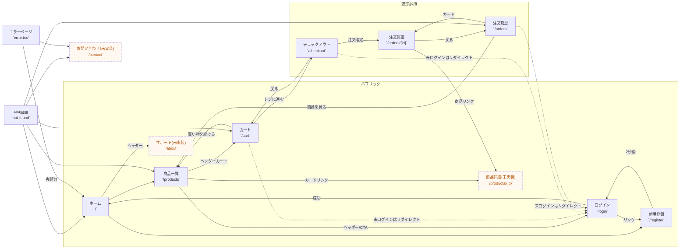

# UI Screen Flow Overview

ECモノリスアプリの主要画面遷移を整理し、公開フロー・会員向けフロー・管理者フローごとにまとめました。Next.js のファイル構成にあわせて遷移元ソースのパスも併記しています。

## グローバルナビと共通導線

- `app/app/layout.tsx`: すべてのページでヘッダーとフッターを共有
- `app/components/Header.tsx`: グローバルナビ（Store `/products`, Support `/about` ※未実装）, カート `/cart`, ログイン `/login`
- `app/components/Footer.tsx`: よく利用するリンク（未実装パス含む）とトップへ戻る導線
- `app/middleware.ts`: `/cart`, `/checkout`, `/orders`, `/admin` へのアクセスを認証・ロールで制御

## パブリック/ショップフロー



### 主要遷移の補足

- `app/app/page.tsx`: ホームから `/products` と `/register` へ誘導
- `app/app/(auth)/register/page.tsx`: 登録成功時に `/login` へ 2 秒後リダイレクト
- `app/app/(auth)/login/page.tsx`: ログイン成功時に `/`
- `app/app/(shop)/products/page.tsx`: 商品カードから `/products/{id}`（未実装）
- `app/components/cart/CartItem.tsx`, `app/app/(shop)/orders/[id]/page.tsx`: 商品詳細リンクを生成
- `app/app/(shop)/cart/page.tsx`: カートから `/checkout`・`/products`
- `app/app/(shop)/checkout/page.tsx`: 注文確定後 `/orders/{orderId}?success=true`
- `app/app/not-found.tsx`, `app/app/error.tsx`: fallback 導線

## 管理者フロー

```mermaid
flowchart LR
  AdminEntry["`/admin*` アクセス"] -->|未ログイン| Login["ログイン\n`/login`"]
  AdminEntry -->|ROLE ≠ ADMIN| Home["ホーム\n`/`"]
  AdminEntry -->|ROLE = ADMIN| AdminDashboard["管理ダッシュボード\n`/admin`"]

  AdminDashboard --> AdminProducts["商品管理\n`/admin/products`"]
  AdminDashboard --> AdminOrders["注文管理\n`/admin/orders`"]
  AdminDashboard --> AdminUsers["ユーザー管理\n`/admin/users`"]
  AdminDashboard -->|最新注文カード| AdminOrderDetail["注文詳細\n`/admin/orders/{id}`"]
  AdminDashboard -->|在庫カード| AdminProducts

  AdminProducts -->|+ 新規商品| AdminProductNew["商品新規作成\n`/admin/products/new`"]
  AdminProductNew -->|保存| AdminProducts
  AdminProducts -->|行の編集| AdminProductEdit["商品編集\n`/admin/products/{id}/edit`"]
  AdminProductEdit -->|保存| AdminProducts

  AdminOrders -->|詳細リンク| AdminOrderDetail
  AdminOrderDetail -->|戻る| AdminOrders

  AdminUsers -->|ロール変更ボタン| AdminUsersQuery["`/admin/users?userId=...` (未実装)"]

  class AdminUsersQuery todo;
  classDef todo stroke-dasharray:4 2,fill:#fff8f0,color:#b45309;
```

### 主要遷移の補足

- `app/app/(admin)/admin/layout.tsx`: ADMIN ロール以外は `/` へリダイレクト
- `app/app/(admin)/admin/page.tsx`: ダッシュボードから各管理画面リンク
- `app/app/(admin)/admin/products/page.tsx`: 商品一覧、編集・削除・新規作成導線
- `app/app/(admin)/admin/products/new/page.tsx` / `[id]/edit/page.tsx`: 作成・更新後 `/admin/products`
- `app/app/(admin)/admin/orders/page.tsx`: 注文一覧から詳細へ遷移
- `app/app/(admin)/admin/orders/[id]/page.tsx`: ステータス変更フォームを配置
- `app/app/(admin)/admin/users/page.tsx`: ロール変更ボタンはクエリ付きで同一ページ再読み込み（UI 未実装）

## 未実装・要確認の遷移

| パス | 誘導元 | メモ |
| --- | --- | --- |
| `/products/{id}` | 商品カード・注文詳細など | 画面未実装 |
| `/about`, `/support` | ヘッダー | 画面未実装 |
| `/contact`, `/faq`, `/terms`, `/privacy`, `/legal`, `/cookies` | フッター・404・エラーページ | 画面未実装 |
| `/admin/users?userId=...` | ユーザー管理ページ | モーダル or 詳細画面は今後実装予定 |

## 画面キャプチャー取得ガイド（Want）

1. `tutorial_ec_site_001_monolith/app` で `npm run dev` を起動
2. ブラウザで主要ページを巡回し、以下を撮影  
   - ホーム、商品一覧、カート、チェックアウト、注文履歴・詳細  
   - ログイン・登録  
   - 管理ダッシュボード、商品/注文/ユーザー管理、商品作成・編集、注文詳細  
3. 画像は `docs/product` 内などに配置し、本ドキュメントから相対リンクで参照可能

---

最終更新日: 2024-XX-XX（更新時に差し替えてください）
