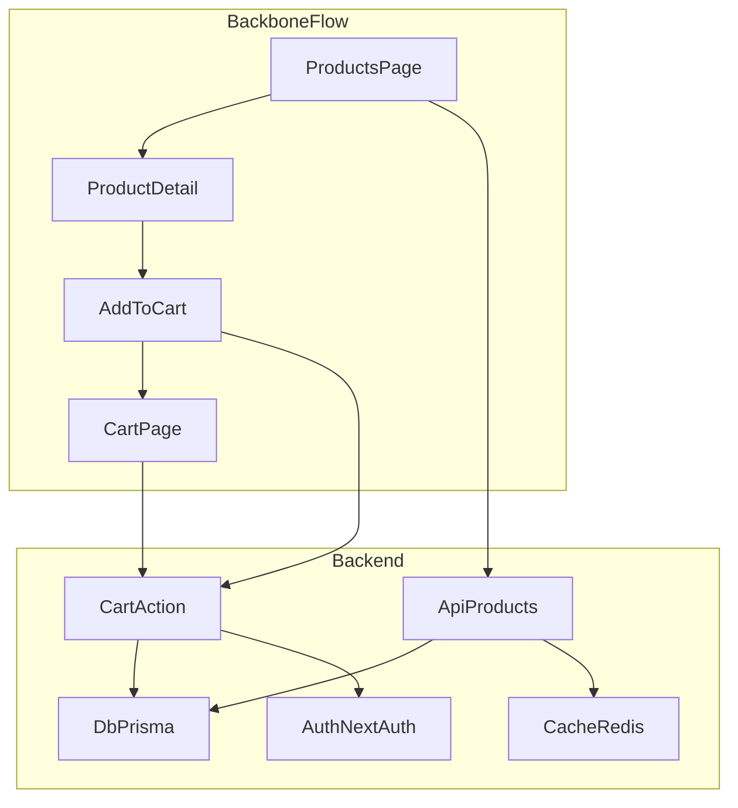

# リファクタリング計画書（UC0-UC2 確定）

この文書は `docs/refacroting/` 配下に散在している計画・戦略メモを **一本化**した「実行可能な計画書（Living）」です。  
実装変更を進めるときは、ここを“入口（Single Source of Entry）”として参照します。

---

## 0. クイックリンク（参照元）

- `docs/refacroting/refs/testing-strategy.md`（テスト追加の基本方針）
- `docs/refacroting/refs/refactoring-plan.md`（フェーズ/イシュー案）
- `docs/refacroting/refs/backbone-io-boundary.md`（背骨フローI/O境界）
- `docs/refacroting/refs/current-status.md`（現状分析・テスト資産/課題）
- `docs/refacroting/refs/document-management.md`（ドキュメント昇格/参照ログ/削除）
- `docs/refacroting/refs/plan.md`（ゴール/思想の原文）

---

## 1. ゴール/ねらい（Why）

- **継続開発で工数が指数関数的に増えない**状態を目指す（機能追加・保守がリニアに増える）。
- **ドキュメントがない/散在する状態でも**、TDDとLiving Documentationで「安全に変えられる」状態を作る。

---

## 2. スコープ（What）

### 確定スコープ（この計画書の対象）

- **UC0**: ガードレール策定（迷子防止）
- **UC1**: 背骨E2Eを“仕様”として固定し、安定化
- **UC2**: 背骨経路のI/O境界を1箇所選んで切り出し（最初はカート推奨）

### 候補（次の段階）

- **UC3**: 横展開（2本目以降の代表フロー）
- **UC4**: 指標の可視化（拡張）

---

## 3. 既存資産の活用（What we already have）

- **E2E**: `app/tests/user-flow.spec.ts`（背骨相当あり・ただしフレーク要因あり）、`app/tests/e2e-navigation/*`（安定）
- **ユニット**: `app/tests/unit/actions/cart.test.ts`（カート操作が高品質）
- **結合**: `app/tests/integration/api/products.test.ts`（モックで真の結合ではない）
- **I/O境界（主要）**: Prisma(DB), Redis(cache), NextAuth(auth/session), S3

---

## 4. 基本原則（How）

### 4.1 テスト戦略（背骨→外周、速い安全網→実I/O→E2E）

`docs/refacroting/refs/testing-strategy.md` を統合した方針です。

- **背骨から外周へ**: 代表フロー（背骨）を起点に広げる
- **速い安全網から足す**: Unit →（実I/Oを使う）Integration → E2E の順
- **1機能あたりの最小追加（目安）**:
  - 触る関数・分岐にユニット1本（30分で最小）
  - 実I/Oが絡むなら統合1本（モックでなく実データ）
  - 背骨に関わるならE2Eに1ステップ追加（安定セレクタ・適切な待機）
- **ゲートの昇格**: 安定した領域から、手動→PRゲートへ段階的に戻す

### 4.2 ドキュメント方針（昇格を先に、物理移動は後）

`docs/refacroting/refs/document-management.md` の運用を前提とします。

- `docs/` は「信頼できる最小集合（Living）」として育てる
- 散在資料はすぐに移動しない。まず **昇格ルール** と **索引** と **参照ログ** を整える
- 不要ファイルは即削除しない（候補化→参照確認→まとめて削除）

### 4.3 意思決定（ADR）

- トレードオフがある変更は **最低3案比較**し、採用理由をADRに残す  
  テンプレ: `docs/architecture/decisions/ADR-TEMPLATE.md`

---

## 5. 全体像（背骨と境界）

背骨フロー: **商品一覧 → 商品詳細 → カート追加 → カート表示**  
詳細なI/O境界は `docs/refacroting/refs/backbone-io-boundary.md` を参照します。

---

## 6. 完了の定義（DoD）

### DoD-UC（ユースケース完了条件・共通）

- **仕様として読める**: Given-When-Thenで説明できる（テストが根拠）
- **安全網がある**: Unit/Integration/E2Eのどれを根拠にしているか明確
- **再現性**: ローカルで手順が再現できる（コマンド、前提、確認が明記）
- **次に進める**: 次のUC/Issueの入り口（リンク）がある

### DoD-Issue（2時間イシュー完了条件・共通）

- 変更範囲が特定されている（ファイル/境界/ユースケース）
- 最小のテスト追加（Unit or Integration or E2E）が完了
- 実行手順/結果がログに残る

---

## 7. UC別の方針（UC0-UC2）

実行用チェックリストは `docs/refacroting/ISSUES-UC0-UC2.md` に切り出します（この文書は方針、Issueリストは実行単位）。

### UC0: ガードレール策定（迷子防止）

- **目的**: 計測と意思決定のルールを先に固め、作業中の判断ブレを防ぐ
- **成果物**:
  - 計画: `docs/refacroting/MASTER-PLAN.md`
  - 実行: `docs/refacroting/ISSUES-UC0-UC2.md`
  - 参照ログ/昇格: `docs/refacroting/refs/document-management.md`
  - 計測ルール: `docs/operations/work-time-tracking.md`
  - ADRテンプレ: `docs/architecture/decisions/ADR-TEMPLATE.md`

### UC1: 背骨E2E仕様化・安定化

`app/tests/user-flow.spec.ts` には以下のフレーク要因が観測されています（数は現状把握の目安）:

- **固定待ち**: `waitForTimeout(...)` が複数（例: 1000ms）
- **曖昧セレクタ**: `[class*="product"], article, .card` のような複合/弱いセレクタが多数
- **検証スキップ**: `isVisible().catch(() => false)` による握りつぶしが複数

方針:

- 背骨は **1本のspecに分離**し、Given-When-Thenで読める形にする
- セレクタは **role/name → data-testid → 最後にCSS** の順で設計する
- 待機は「待つべき状態」に寄せ、固定待ちを減らす
- 失敗を握りつぶさない（テストは仕様書であり安全網）

### UC2: 背骨経路の境界切り出し（最初はカート推奨）

`docs/refacroting/refs/backbone-io-boundary.md` の評価に基づき、最初の対象は **`lib/actions/cart.ts`** を推奨します。

- 理由:
  - ユニットテスト資産が強い（既存が高品質）
  - 変更頻度が高い（ビジネスの中心）
  - I/O境界が比較的明確（DB + Auth）
- 追加で必要な安全網:
  - 実DBを使った結合テスト（モックでなく“真の結合”）
  - 背骨E2E（安定した1本）

---

## 8. PRゲート昇格（段階復帰の考え方）

現状のCIは GitLab（`.gitlab-ci.yml`）で、**lint と build はすでに push / merge request で実行**されています。  
一方で、テスト（Vitest / Playwright）は `app/package.json` にスクリプトはあるものの、CIに載せる運用はこれからです。

### 8.1 段階昇格の方針

- いきなり全領域をゲート化しない（フレークや環境差で逆に開発速度が落ちるため）
- **安定した領域から**、手動→ゲート（必須）へ段階的に昇格する

### 8.2 ゲート候補と昇格条件（目安）

| 種別 | コマンド（例） | まずは | ゲート（必須）へ昇格する条件 |
|---|---|---|---|
| Lint | `npm run lint` | すでにCI実行 | （現状維持） |
| Build | `npm run build` | すでにCI実行 | （現状維持） |
| Unit | `npm run test:unit` | 手動/ローカル | 直近の変更領域で安定（連続実行で安定、実行時間が許容） |
| Integration | `npm run test:integration` | 手動/ローカル | 実I/O（実DB等）を使う前提が固まり、再現手順が明確 |
| E2E（背骨） | `npm run test:e2e`（または背骨specのみ） | 手動/限定運用 | 3回連続で安定し、セレクタ/待機が“状態待ち”中心でフレーク要因が潰れている |

※「昇格する条件」は、UC0で定める **DoD** と整合させ、必要ならADRで判断します。

---

## 付録: 背骨E2Eの仕様（Given-When-Thenの最小形）

- Given: 商品一覧を開いている
- When: 商品を選び、カートに追加する
- Then: カートにその商品が表示される

