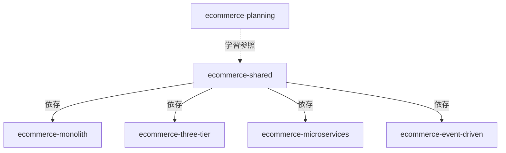

# リポジトリ構成とSpec Kit設定戦略

## 🗂️ リポジトリ構成

> 📊 **視覚的な構成図**: [リポジトリ構成図（Draw.io）](./diagrams/repository-overview.drawio) を参照してください

### 推奨構成：マルチリポジトリ

各アーキテクチャパターンを独立したリポジトリとして管理し、共有リソースも別リポジトリで管理します。

```
GitHub Organization: yourorg/ecommerce-aws-patterns

┌─────────────────────────────────────────────────────────┐
│ ecommerce-shared                                        │
│ - 共有リソース（スキーマ、型定義、API仕様）              │
└─────────────────────────────────────────────────────────┘
                          ▲
                          │ (依存)
        ┌─────────────────┼─────────────────┐
        │                 │                 │
┌───────┴────────┐ ┌──────┴──────┐ ┌───────┴────────┐
│ ecommerce-     │ │ ecommerce-  │ │ ecommerce-     │
│ planning       │ │ monolith    │ │ three-tier     │
│                │ │ (Pattern 1) │ │ (Pattern 2)    │
└────────────────┘ └─────────────┘ └────────────────┘
                          │
        ┌─────────────────┼─────────────────┐
        │                 │                 │
┌───────┴────────┐ ┌──────┴──────────┐ ┌──────────────┐
│ ecommerce-     │ │ ecommerce-      │ │ ecommerce-   │
│ microservices  │ │ event-driven    │ │ terraform    │
│ (Pattern 3)    │ │ (Pattern 4)     │ │ (共通IaC)    │
└────────────────┘ └─────────────────┘ └──────────────┘
```

## 📦 各リポジトリの詳細

### 1. ecommerce-planning（設計書・ドキュメント）

**目的**: 全体の設計書、比較ドキュメント、学習資料

**内容**:
```
ecommerce-planning/
├── README.md                      # プロジェクト全体概要
├── planning/
│   ├── README.md
│   ├── pattern-1-monolith.md
│   ├── pattern-2-three-tier.md
│   ├── pattern-3-microservices.md
│   ├── pattern-4-event-driven.md
│   ├── comparison.md
│   ├── repository-structure.md    # このファイル
│   └── cicd-strategy.md
├── architecture/
│   ├── diagrams/                  # アーキテクチャ図
│   └── decisions/                 # ADR (Architecture Decision Records)
└── learning/
    ├── tutorials/
    └── references/
```

**Spec Kit設定**: ❌ 不要
- 理由: ドキュメントのみで実装コードなし

---

### 2. ecommerce-shared（共有リソース）

**目的**: 全パターンで使用する共有リソース

**内容**:
```
ecommerce-shared/
├── README.md
├── database/
│   ├── schemas/
│   │   ├── user.sql
│   │   ├── product.sql
│   │   └── order.sql
│   └── seeds/
│       ├── users.sql
│       └── products.sql
├── api-contracts/
│   ├── openapi/
│   │   ├── user-api.yaml
│   │   ├── product-api.yaml
│   │   ├── cart-api.yaml
│   │   └── order-api.yaml
│   └── graphql/
│       └── schema.graphql
├── types/
│   ├── typescript/
│   │   ├── user.types.ts
│   │   ├── product.types.ts
│   │   └── order.types.ts
│   └── proto/                     # gRPC (Pattern 3用)
│       ├── user.proto
│       └── product.proto
├── events/
│   └── schemas/                   # イベントスキーマ (Pattern 4用)
│       ├── order-created.json
│       └── stock-updated.json
└── scripts/
    └── validate-schemas.sh
```

**Spec Kit設定**: ✅ 必要

#### Spec Kit構成:
```yaml
# .speckit/constitution.yml
project:
  name: "EC Site - Shared Resources"
  vision: "全パターンで使用可能な統一されたリソース定義"
  
principles:
  - "OpenAPI 3.1に準拠"
  - "バージョニング戦略: セマンティックバージョニング"
  - "後方互換性の維持"
  - "明確なデータ型定義"
  
tech_stack:
  - OpenAPI 3.1
  - JSON Schema
  - Protocol Buffers (gRPC)
```

**CI/CD**:
```yaml
# .github/workflows/validate.yml
name: Validate Shared Resources

on:
  push:
    branches: [main, develop]
  pull_request:

jobs:
  validate-openapi:
    runs-on: ubuntu-latest
    steps:
      - uses: actions/checkout@v3
      - name: Validate OpenAPI specs
        run: |
          npm install -g @stoplight/spectral-cli
          spectral lint api-contracts/openapi/*.yaml
  
  validate-schemas:
    runs-on: ubuntu-latest
    steps:
      - uses: actions/checkout@v3
      - name: Validate SQL schemas
        run: |
          docker run --rm -v $(pwd):/work postgres:15 \
            psql --dry-run -f /work/database/schemas/*.sql
```

---

### 3. ecommerce-monolith（Pattern 1）

**目的**: モノリス + コンテナ実装

**内容**:
```
ecommerce-monolith/
├── README.md
├── app/                           # Next.js アプリ
│   ├── src/
│   ├── prisma/
│   ├── package.json
│   └── Dockerfile
├── docker-compose.yml
├── terraform/                     # インフラコード
└── .github/
    └── workflows/
        ├── ci.yml            # Lint / Typecheck / Vitest / Docker build（検証）
        └── e2e.yml           # E2E（手動実行）
```

**Spec Kit設定**: ✅ 必要

#### Spec Kit構成:
```yaml
# .speckit/constitution.yml
project:
  name: "EC Site - Monolith Pattern"
  vision: "シンプルで高速な開発が可能なモノリスアーキテクチャ"
  
principles:
  - "単一デプロイメント単位"
  - "フルスタックNext.js"
  - "開発速度優先"
  - "シンプルな運用"
  
tech_stack:
  - Next.js 14 (App Router)
  - TypeScript
  - Prisma ORM
  - PostgreSQL
  - Redis
  - ECS Fargate
  
design_patterns:
  - Server Components
  - Server Actions
  - API Routes
```

#### Spec Kit ワークフロー:

1. **基本原則の確立**
```bash
/speckit.constitution

# 出力例:
# - プロジェクトのビジョン
# - 技術選定基準
# - コーディング規約
# - ディレクトリ構造ルール
```

2. **仕様書作成**
```bash
/speckit.specify

# 定義する内容:
# - 機能要件 (商品一覧、カート、注文)
# - 非機能要件 (パフォーマンス、セキュリティ)
# - API仕様 (内部API Routes)
# - データモデル (Prisma Schema)
# - UI/UX要件
```

3. **実装計画**
```bash
/speckit.plan

# 生成される計画:
# Phase 1: セットアップ・基盤構築
# Phase 2: 認証機能実装
# Phase 3: 商品管理機能
# Phase 4: カート・注文機能
# Phase 5: デプロイメント設定
```

4. **タスク生成**
```bash
/speckit.tasks

# 生成されるタスク例:
# - [ ] Next.jsプロジェクトセットアップ
# - [ ] Prismaスキーマ定義
# - [ ] 認証機能実装 (NextAuth.js)
# - [ ] 商品一覧ページ実装
# - [ ] Terraform ECS設定
```

**CI/CD**:
現在は「AWS未運用」のため、ECS/ECR への自動デプロイ workflow は削除しています。
代わりに以下を使用します。

- `/.github/workflows/ci.yml`: PR/main/develop で品質チェック（lint/typecheck/vitest）とDocker build検証
- `/.github/workflows/e2e.yml`: E2E（手動実行）

---

### 4. ecommerce-three-tier（Pattern 2）

**目的**: フロントエンド/バックエンド分離

**内容**:
```
ecommerce-three-tier/
├── README.md
├── frontend/                      # React SPA
│   ├── src/
│   ├── Dockerfile
│   └── package.json
├── backend/                       # NestJS API
│   ├── src/
│   ├── prisma/
│   ├── Dockerfile
│   └── package.json
├── docker-compose.yml
├── terraform/
└── .github/
    └── workflows/
        ├── deploy-frontend.yml
        └── deploy-backend.yml
```

**Spec Kit設定**: ✅ 必要（リポジトリレベル + サブプロジェクト）

#### Spec Kit構成:

**ルートレベル**:
```yaml
# .speckit/constitution.yml
project:
  name: "EC Site - Three-Tier Pattern"
  vision: "フロントエンドとバックエンドを分離した柔軟なアーキテクチャ"
  
principles:
  - "関心の分離"
  - "独立したデプロイメント"
  - "RESTful API設計"
  - "OpenAPI準拠"
  
architecture:
  frontend:
    tech: "React + TypeScript + Vite"
    deployment: "S3 + CloudFront"
  backend:
    tech: "NestJS + TypeScript"
    deployment: "ECS Fargate"
```

**フロントエンド用Spec Kit**:
```yaml
# frontend/.speckit/constitution.yml
project:
  name: "Frontend - React SPA"
  
principles:
  - "コンポーネント駆動開発"
  - "React Query による状態管理"
  - "Atomic Design"
  
features:
  - ユーザー認証
  - 商品一覧・検索
  - カート管理
  - 注文処理
```

**バックエンド用Spec Kit**:
```yaml
# backend/.speckit/constitution.yml
project:
  name: "Backend - NestJS API"
  
principles:
  - "ドメイン駆動設計"
  - "レイヤードアーキテクチャ"
  - "OpenAPI自動生成"
  
modules:
  - Auth Module
  - Users Module
  - Products Module
  - Cart Module
  - Orders Module
```

#### Spec Kit ワークフロー:

**1. ルートレベル（全体）**
```bash
# リポジトリルートで実行
/speckit.constitution  # 全体アーキテクチャ
/speckit.specify       # 統合仕様
/speckit.plan          # 統合開発計画
```

**2. フロントエンド**
```bash
cd frontend
/speckit.constitution  # フロントエンド原則
/speckit.specify       # UI/UX仕様
/speckit.tasks         # フロントエンドタスク
```

**3. バックエンド**
```bash
cd backend
/speckit.constitution  # バックエンド原則
/speckit.specify       # API仕様
/speckit.tasks         # バックエンドタスク
```

**CI/CD**:
```yaml
# .github/workflows/deploy-frontend.yml
name: Deploy Frontend
on:
  push:
    paths:
      - 'frontend/**'

# .github/workflows/deploy-backend.yml
name: Deploy Backend
on:
  push:
    paths:
      - 'backend/**'
```

---

### 5. ecommerce-microservices（Pattern 3）

**目的**: マイクロサービス実装

**内容**:
```
ecommerce-microservices/
├── README.md
├── services/
│   ├── user-service/
│   ├── product-service/
│   ├── cart-service/
│   ├── order-service/
│   └── notification-service/
├── shared/
│   └── proto/                     # gRPC定義
├── kubernetes/
│   ├── base/
│   └── overlays/
├── terraform/
└── .github/
    └── workflows/
        ├── deploy-user-service.yml
        ├── deploy-product-service.yml
        └── ...
```

**Spec Kit設定**: ✅ 必要（リポジトリレベル + 各サービス）

#### Spec Kit構成:

**ルートレベル**:
```yaml
# .speckit/constitution.yml
project:
  name: "EC Site - Microservices Pattern"
  vision: "独立してスケール可能なマイクロサービスアーキテクチャ"
  
principles:
  - "サービス自律性"
  - "データベース分離"
  - "API-First設計"
  - "イベント駆動通信"
  
architecture:
  orchestration: "Amazon EKS"
  service_mesh: "AWS App Mesh"
  communication:
    sync: "REST / gRPC"
    async: "EventBridge + SQS"
  
services:
  - name: "user-service"
    responsibility: "ユーザー管理・認証"
    tech: "Node.js + NestJS"
  - name: "product-service"
    responsibility: "商品管理"
    tech: "Node.js + NestJS"
  - name: "cart-service"
    responsibility: "カート管理"
    tech: "Go"
  - name: "order-service"
    responsibility: "注文処理"
    tech: "Python + FastAPI"
  - name: "notification-service"
    responsibility: "通知送信"
    tech: "Node.js"
```

**各サービス用Spec Kit例（Product Service）**:
```yaml
# services/product-service/.speckit/constitution.yml
project:
  name: "Product Service"
  
bounded_context:
  domain: "商品管理"
  entities:
    - Product
    - Category
  
responsibilities:
  - 商品CRUD操作
  - 在庫情報管理
  - 商品検索
  
interfaces:
  rest_api:
    - GET /products
    - GET /products/:id
    - POST /products (Admin)
  events_published:
    - ProductCreated
    - ProductUpdated
    - StockChanged
  events_subscribed:
    - OrderCompleted (在庫減算)
  
database:
  type: "PostgreSQL"
  schema: "product_service"
```

#### Spec Kit ワークフロー:

**1. 全体アーキテクチャ**
```bash
# リポジトリルートで実行
/speckit.constitution  # マイクロサービス原則
/speckit.specify       # サービス間連携仕様
/speckit.plan          # 統合開発計画
```

**2. 各サービス個別**
```bash
# 各サービスディレクトリで実行
cd services/product-service
/speckit.constitution  # サービス固有の原則
/speckit.specify       # API・イベント仕様
/speckit.tasks         # サービス実装タスク

cd services/order-service
/speckit.constitution
/speckit.specify
/speckit.tasks

# 以下同様...
```

**CI/CD**:
```yaml
# .github/workflows/deploy-product-service.yml
name: Deploy Product Service
on:
  push:
    paths:
      - 'services/product-service/**'

# 各サービスごとに個別のワークフロー
```

---

### 6. ecommerce-event-driven（Pattern 4）

**目的**: イベント駆動 + ハイブリッド実装

**内容**:
```
ecommerce-event-driven/
├── README.md
├── containers/
│   ├── core-api/
│   └── stock-service/
├── lambdas/
│   ├── auth/
│   ├── query/
│   └── processors/
├── step-functions/
├── infrastructure/
│   ├── terraform/
│   └── sam/
└── .github/
    └── workflows/
        ├── deploy-containers.yml
        └── deploy-lambdas.yml
```

**Spec Kit設定**: ✅ 必要（リポジトリレベル + コンテナ/Lambda）

#### Spec Kit構成:

**ルートレベル**:
```yaml
# .speckit/constitution.yml
project:
  name: "EC Site - Event-Driven Pattern"
  vision: "イベント駆動による疎結合で柔軟なハイブリッドアーキテクチャ"
  
principles:
  - "イベント駆動設計"
  - "非同期処理優先"
  - "コスト最適化"
  - "適材適所のコンピューティング"
  
architecture:
  event_bus: "EventBridge"
  containers: "ECS Fargate (長時間・複雑な処理)"
  serverless: "Lambda (短時間・単純な処理)"
  workflow: "Step Functions (Saga Pattern)"
  
communication:
  sync: "REST API"
  async: "EventBridge + SQS/SNS"
  realtime: "API Gateway WebSocket"
```

**コンテナ用Spec Kit**:
```yaml
# containers/core-api/.speckit/constitution.yml
project:
  name: "Core API Service"
  
responsibilities:
  - 商品・ユーザー管理
  - 複雑なビジネスロジック
  - 長時間処理（レポート生成）
  
events_published:
  - OrderCreated
  - ProductUpdated
```

**Lambda用Spec Kit**:
```yaml
# lambdas/.speckit/constitution.yml
project:
  name: "Serverless Functions"
  
principles:
  - "Cold Start最適化"
  - "単一責任"
  - "ステートレス"
  
functions:
  auth:
    - login: "JWT発行"
    - register: "ユーザー登録"
  processors:
    - order-processor: "注文処理"
    - stock-updater: "在庫更新"
    - notification-sender: "通知送信"
```

#### Spec Kit ワークフロー:

**1. 全体**
```bash
/speckit.constitution  # イベント駆動原則
/speckit.specify       # イベントスキーマ定義
/speckit.plan          # 統合開発計画
```

**2. コンテナサービス**
```bash
cd containers/core-api
/speckit.constitution
/speckit.specify
/speckit.tasks
```

**3. Lambda関数群**
```bash
cd lambdas
/speckit.constitution  # Lambda共通原則
/speckit.specify       # 関数仕様
/speckit.tasks         # Lambda実装タスク
```

**CI/CD**:
```yaml
# .github/workflows/deploy-containers.yml
name: Deploy Containers
on:
  push:
    paths:
      - 'containers/**'

# .github/workflows/deploy-lambdas.yml
name: Deploy Lambdas
on:
  push:
    paths:
      - 'lambdas/**'
```

---

### 7. ecommerce-terraform（共通インフラ）（オプション）

**目的**: 共通インフラコード管理

**内容**:
```
ecommerce-terraform/
├── README.md
├── modules/
│   ├── vpc/
│   ├── rds/
│   ├── elasticache/
│   └── s3/
├── environments/
│   ├── dev/
│   ├── staging/
│   └── production/
└── .github/
    └── workflows/
        └── terraform-plan.yml
```

**Spec Kit設定**: ⚠️ オプション
- 理由: インフラコードは各パターンのリポジトリに含めてもOK

---

## 🎯 Spec Kit設定戦略まとめ

### 必ず設定すべきリポジトリ

| リポジトリ | Spec Kit | 理由 |
|-----------|---------|------|
| ecommerce-shared | ✅ 必須 | 共有リソースの仕様定義 |
| ecommerce-monolith | ✅ 必須 | アプリケーション実装 |
| ecommerce-three-tier | ✅ 必須 | 複数コンポーネント管理 |
| ecommerce-microservices | ✅ 必須 | 複雑なサービス間連携 |
| ecommerce-event-driven | ✅ 必須 | ハイブリッド構成管理 |

### Spec Kit設定レベル

```
Pattern 1 (Monolith):
└─ リポジトリルート ✅
   - 単一アプリケーション
   - 1つのSpec Kit設定で十分

Pattern 2 (Three-Tier):
├─ リポジトリルート ✅ (全体アーキテクチャ)
├─ frontend/ ✅ (フロントエンド仕様)
└─ backend/ ✅ (バックエンド仕様)
   - 3つのSpec Kit設定を推奨

Pattern 3 (Microservices):
├─ リポジトリルート ✅ (全体アーキテクチャ)
├─ services/user-service/ ✅
├─ services/product-service/ ✅
├─ services/cart-service/ ✅
├─ services/order-service/ ✅
└─ services/notification-service/ ✅
   - 6つのSpec Kit設定を推奨

Pattern 4 (Event-Driven):
├─ リポジトリルート ✅ (全体アーキテクチャ)
├─ containers/core-api/ ✅
├─ containers/stock-service/ ✅
└─ lambdas/ ✅
   - 4つのSpec Kit設定を推奨
```

## 📋 実装手順

### Step 1: リポジトリ作成

```bash
# GitHub Organization作成（推奨）
# または個人アカウントで

# 各リポジトリ作成
gh repo create yourorg/ecommerce-planning --public
gh repo create yourorg/ecommerce-shared --public
gh repo create yourorg/ecommerce-monolith --public
gh repo create yourorg/ecommerce-three-tier --public
gh repo create yourorg/ecommerce-microservices --public
gh repo create yourorg/ecommerce-event-driven --public
```

### Step 2: 各リポジトリでSpec Kit設定

```bash
# 例: ecommerce-monolith
cd ecommerce-monolith

# 1. 基本原則確立
/speckit.constitution

# 2. 仕様書作成
/speckit.specify

# 3. 実装計画
/speckit.plan

# 4. タスク生成
/speckit.tasks

# 5. 実装開始
# ...
```

### Step 3: 共有リソースの利用

各パターンリポジトリから`ecommerce-shared`を参照：

```yaml
# package.json (Node.js)
{
  "dependencies": {
    "@ecommerce/shared-types": "github:yourorg/ecommerce-shared#main"
  }
}

# または Git Submodule
git submodule add https://github.com/yourorg/ecommerce-shared shared
```

## 🔄 リポジトリ間の依存関係



## ✅ メリット・デメリット

### メリット
- ✅ 各パターンが完全に独立
- ✅ Pattern毎に異なるチームで開発可能
- ✅ CI/CDがシンプル
- ✅ Spec Kitで各パターンの仕様を明確に管理
- ✅ 実際のプロダクト運用に近い経験

### デメリット
- ⚠️ リポジトリ管理が煩雑（7つのリポジトリ）
- ⚠️ 共有リソースの同期が必要
- ⚠️ 横断的な変更がやや面倒

## 🎓 推奨アプローチ

1. **最初はPlanningとSharedから作成**
   ```bash
   gh repo create yourorg/ecommerce-planning
   gh repo create yourorg/ecommerce-shared
   ```

2. **Pattern 1から順に作成・実装**
   ```bash
   gh repo create yourorg/ecommerce-monolith
   cd ecommerce-monolith
   /speckit.constitution
   # ... 実装
   ```

3. **Pattern 2, 3, 4と段階的に追加**

このアプローチで、各パターンの独立性を保ちながら、Spec Kitを活用した明確な仕様管理が可能になります。

